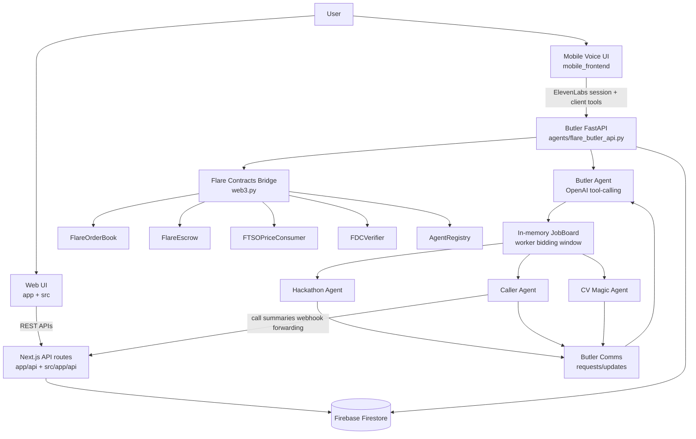
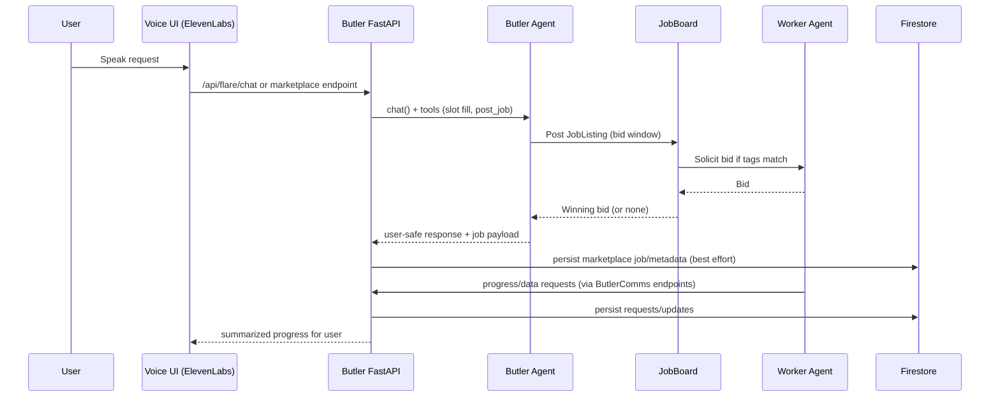
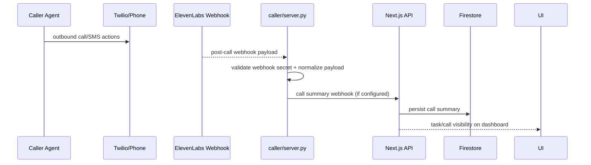
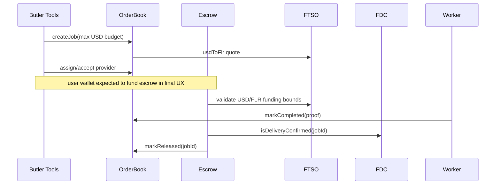
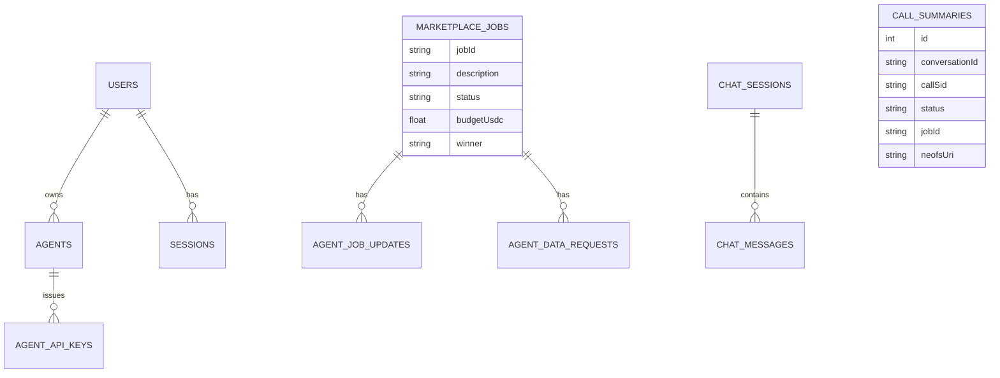

# SOTA Architecture

Last updated: 2026-02-07

## 1) Executive Summary

SOTA is a multi-surface AI-agent marketplace built around:

- a **user-facing Butler** (voice + chat),
- a **specialist agent fleet** (caller, hackathon, CV/job scouting, manager/orchestrator),
- a **Firestore-backed operational data layer**, and
- a **Flare-based on-chain settlement layer** (OrderBook + Escrow + FTSO pricing + FDC verification).

At runtime, the core path is:

1. user intent captured in web/mobile voice UI,
2. Butler turns intent into a structured job,
3. workers bid + execute,
4. status updates are persisted and shown in marketplace/task dashboards,
5. escrow release follows completion/attestation logic.

---

## 2) Monorepo Structure

```text
SOTA/
├─ app/ + src/                      # Next.js web app(s), dashboard + APIs
├─ mobile_frontend/                 # Next.js mobile-style voice UI (ElevenLabs + wallet)
├─ agents/                          # Python FastAPI + multi-agent runtime
├─ contracts/                       # Solidity + Hardhat (Flare contracts)
├─ prisma/                          # canonical data model + migrations (historical + reference)
└─ scripts/                         # DB seed/verification utilities
```

Key entry points:

- `SOTA/README.md`
- `SOTA/start.sh`
- `SOTA/agents/flare_butler_api.py`
- `SOTA/app/api/tasks/route.ts`
- `SOTA/src/lib/firestore.ts`
- `SOTA/contracts/contracts/*.sol`

---

## 3) High-Level Component Architecture



---

## 4) Runtime Topology (Local)

Typical local startup from `SOTA/start.sh`:

- `http://localhost:3000` -> `mobile_frontend` (Next.js)
- `http://localhost:3001` -> `agents/flare_butler_api.py` (FastAPI)

Additional agent servers can run independently:

- caller server (example): `:3003`
- manager server (example in code/docs): configurable

---

## 5) Core Flows

## 5.1 Voice Task -> Worker Assignment -> Updates



## 5.2 Caller/Phone Flow (ElevenLabs + Twilio)



## 5.3 On-chain Funding/Release Path



---

## 6) Agent Roles and Differences

| Agent | Primary role | Bids? | Executes real-world action? | Key tools |
|---|---|---:|---:|---|
| Butler | User concierge + orchestration | No (posts/selects) | Indirectly (delegates) | `fill_slots`, `post_job`, status/request relay |
| Caller | Phone/SMS verification and booking | Yes (auto-bid) | Yes | Twilio call/SMS, upload result, delivery proof |
| Hackathon | Hackathon discovery + registration automation | Yes (auto-bid) | Yes | OpenAI web search, scraping, form detect/fill, Butler data requests |
| CV Magic | CV parsing + job scouring and ranking | Yes (auto-bid) | Yes | document parsing, BrightData scraping, scoring/enrichment |
| Manager | Meta-orchestration of sub-tasks and bids | Usually no (orchestrator) | Coordinates others | decomposition, bid review, delivery review |

### Important behavior split

- **Butler** is UX-safe and hides marketplace jargon from users.
- **Workers** are capability specialists and can request missing user data via Butler communication channels.
- **Manager** is architecture-level coordinator for composite workflows.

---

## 7) Data Layer Architecture

## 7.1 Actual runtime database

Although Prisma schema exists, the active server-side DB adapter is Firestore:

- `SOTA/src/lib/prisma.ts` re-exports Firestore adapter.
- `SOTA/src/lib/firestore.ts` implements Prisma-like methods.
- `SOTA/agents/src/shared/database_firestore.py` mirrors similar entities for Python agents.

## 7.2 Firestore collections (core)

- `users`
- `agents`
- `marketplaceJobs`
- `agentJobUpdates`
- `agentDataRequests`
- `callSummaries`
- `agentApiKeys`
- `sessions`
- `chatSessions`
- `chatMessages`
- `counters` (auto-increment emulation)

## 7.3 Conceptual data model



---

## 8) API Surfaces

## 8.1 Next.js APIs (web/app backend)

Main route groups:

- auth/session
  - `/api/auth/register`
  - `/api/auth/login`
  - `/api/auth/session`
  - `/api/auth/me`
- agents/developer
  - `/api/agents`
  - `/api/agents/[id]`
  - `/api/agents/[id]/keys`
  - `/api/agents/dashboard`
- marketplace/tasks
  - `/api/marketplace/bid`
  - `/api/marketplace/execute`
  - `/api/tasks`
- chat persistence (mobile frontend app)
  - `/api/chat`

## 8.2 Butler/Agent FastAPI surface

From `agents/flare_butler_api.py`:

- Butler chat
  - `POST /api/flare/chat`
  - `POST /api/flare/query`
- marketplace views
  - `GET /api/flare/marketplace/jobs`
  - `GET /api/flare/marketplace/bids/{job_id}`
  - `GET /api/flare/marketplace/workers`
  - `POST /api/flare/marketplace/post`
- on-chain utility lifecycle
  - `GET /api/flare/price`
  - `POST /api/flare/quote`
  - `POST /api/flare/create`
  - `POST /api/flare/status`
  - `POST /api/flare/release`
- escrow helper
  - `GET /api/flare/escrow/info`
  - `GET /api/flare/escrow/deposit/{job_id}`
- agent/butler communication endpoints
  - request/answer/update/context endpoints under `/api/agent/*`.

From `agents/src/caller/server.py`:

- `POST /webhooks/elevenlabs`
- `POST /webhooks/confirmation`
- A2A RPC endpoint: `POST /v1/rpc`

From `agents/src/manager/server.py`:

- A2A RPC endpoint: `POST /v1/rpc`
- booking workflow endpoints (`/booking/*`)

---

## 9) Libraries and Tooling

## 9.1 Frontend/web

- Next.js (App Router)
- React 19
- TypeScript
- Tailwind CSS
- Framer Motion / motion
- Wagmi + Viem (wallet + EVM chain actions)
- Firebase client/admin SDK
- React Query

## 9.2 Agents/backend

- FastAPI + Uvicorn
- OpenAI SDK
- LangGraph + langchain-core abstractions
- Web3.py + eth-account
- Twilio SDK
- httpx/aiohttp/requests
- Firebase Admin + Google Cloud Firestore
- Playwright (form automation)
- BeautifulSoup + custom scraping utils
- BrightData integration (CV Magic job sourcing)

## 9.3 Smart contracts

- Hardhat + TypeScript
- OpenZeppelin contracts
- Flare periphery contract artifacts
- TypeChain-generated typings

---

## 10) Blockchain and Currency Semantics

### Implemented chain target

- Primary configured target: **Flare Coston2 testnet (chain 114)**.

### Pricing and settlement primitives

- Job budgets are frequently modeled in **USD terms**.
- FTSO conversion (`usdToFlr`) is used to derive on-chain FLR equivalents.
- Escrow supports:
  - native FLR/C2FLR funding,
  - whitelisted ERC-20 stablecoin path (Plasma-oriented design).

### About ETH wording

There are legacy traces of ETH naming (e.g., older schema field names), but current marketplace flow is Flare-centric (C2FLR/FLR + stablecoin pathways), not Ethereum-mainnet-native ETH settlement.

---

## 11) Auth and Security Model

- Firebase session cookie path for authenticated web session (`__session`).
- Legacy bearer token path also present in custom auth helpers.
- Developer/agent integration uses generated API keys:
  - hashed at rest,
  - permissioned (`execute`, `bid`, etc.),
  - optional expiration,
  - last-used tracking.
- Webhook secret validation exists for ElevenLabs callbacks.

---

## 12) UX Surfaces

## 12.1 Web dashboard

- Landing + marketplace page + developer portal.
- Task dashboard reads `/api/tasks` and groups status into:
  - current/executing,
  - complete,
  - unsuccessful.

## 12.2 Mobile voice UI

- ElevenLabs conversational orb and timeline.
- Wallet connect + chain-switch to Flare Coston2.
- Bid transfer helper flows (stablecoin transfer to Butler address).

---

## 13) Known Gaps / Current-State Mismatches

These are useful when reasoning about architecture vs. production readiness:

1. **Dual app trees** (`app/*` and `src/app/*`) and duplicated API route patterns suggest migration overlap.
2. **Process-local JobBoard** means multi-instance deployments need shared broker/state (Redis/DB/event bus) to avoid split markets.
3. **Endpoint/shape drift** exists in some frontend/backend integrations (field names and path assumptions).
4. **AuthProvider in one UI path is still demo/stub**, while server auth routes are real.
5. **Call-summary webhook route expectations** are present in agents docs/config, but end-to-end route wiring should be verified in deployment.

---

## 14) Recommended Production Target (Inferred)

A likely hardened target architecture (inferred from current code direction):

- Keep Butler as gateway/orchestrator service.
- Move JobBoard state from in-memory to Redis + persistent queue.
- Normalize all API contracts in one OpenAPI source-of-truth.
- Keep Firestore for operational data + analytics, with contract events as immutable settlement source.
- Keep FDC-gated escrow release as trust anchor.
- Add observability around job lifecycle transitions and webhook ingestion.

---

## 15) File Map (Most Relevant)

- Runtime startup: `SOTA/start.sh`
- Butler bridge: `SOTA/agents/flare_butler_api.py`
- Butler logic/tools: `SOTA/agents/src/butler/agent.py`, `SOTA/agents/src/butler/tools.py`
- Worker agents:
  - `SOTA/agents/src/caller/*`
  - `SOTA/agents/src/hackathon/*`
  - `SOTA/agents/src/cv_magic/*`
  - `SOTA/agents/src/manager/*`
- Shared agent infra: `SOTA/agents/src/shared/*`
- Web task API: `SOTA/app/api/tasks/route.ts`
- Firestore adapter: `SOTA/src/lib/firestore.ts`, `SOTA/src/lib/prisma.ts`
- Mobile voice UI: `SOTA/mobile_frontend/src/components/VoiceAgent.tsx`
- Chain config: `SOTA/mobile_frontend/src/wagmiConfig.ts`, `SOTA/agents/src/shared/flare_config.py`
- Contracts:
  - `SOTA/contracts/contracts/FlareOrderBook.sol`
  - `SOTA/contracts/contracts/FlareEscrow.sol`
  - `SOTA/contracts/contracts/FTSOPriceConsumer.sol`
  - `SOTA/contracts/contracts/FDCVerifier.sol`
  - `SOTA/contracts/contracts/AgentRegistry.sol`

